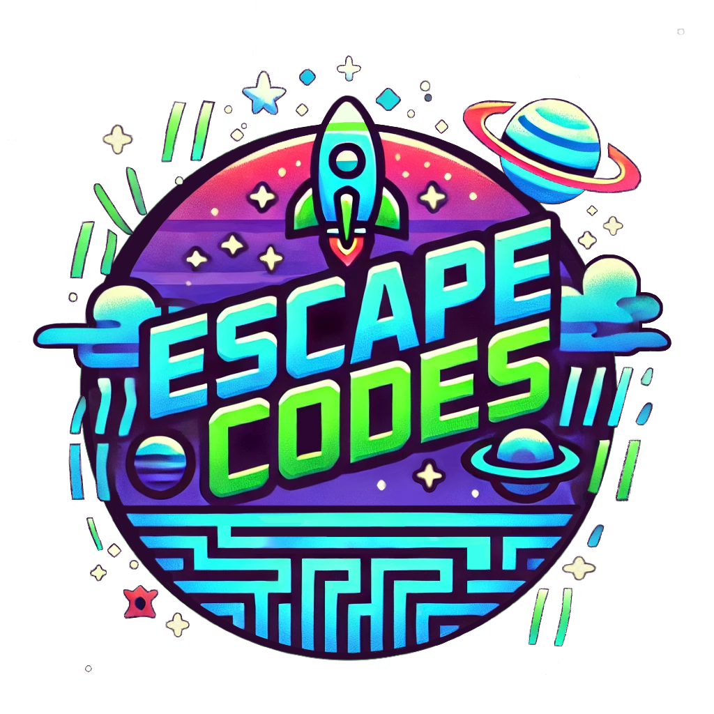

# EscapeCodes

<div align="center"> 
 
</div>

A story-based video game which helps aspiring software engineers study for technical interviews.

## Featuring
- Integration with Leetcode, the leading interview preparation platform ✅
- In game puzzles which re-enforce key data structure and algorithm concepts 🚧
- Curated study plan so you don't have to do the work of figuring out what the most important questions to solve are 🚧

## Controls
 - WASD to move
 - Q to zoom camera in
 - E to zoom camera out
 - P to punch
 - SPACEBAR to dash

## Overview
The year is 2099 and the world is running out of water due to the resource consumption of massive AI data centers. As water becomes more scarce, tech companies are seeing their profits shrink and fear they will soon lose power. In a bid to save their companies, the world's tech billionaires have poured massive investment into space research and succesfully launched an expedition to Mars, attracted by the abundance of ice which they can harvest and sell back on Earth. 

Volunteers are needed to be part of the first Mars colony. Some step up with eagerness, true believers of the mission, while others volunteer out of a desperation to escape the challenges of life on Earth. The motivations of Humanity++, as the group is called, are ultimately insignificant; their memories are wiped before the journey and they are placed in deep cryogenic sleep, only to be woken upon reaching Mars.  

Or, at least, that was the plan. An unknown amount of time into the journey at an unknown location between Earth and Mars, you find yourself rudely awoken, crashing through the glass of a cryogenic chamber, red alarms flashing all around you. With no memory of your previous life you must re-learn fundamental CS concepts in a desperate attempt to hack your way through the ship and save yourself from certain doom.

Along the way you will piece together the story of your past life, fight rogue robots and crazy billionaires, and attempt to make friends with an aggresively misanthropic sentient Roomba.

## Run through interpreter

First activate your python virtual environment

```
source env/bin/activate
```

If you don't have a virtual environment create one with

```
python3 -m venv env
```

Install dependencies (make sure your virtual environment is activated!)

```
pip install -r requirements.txt
```

Run with

```
python3 -m src.main
```

## Build standalone executable

We use pyinstaller to create the bundle

For Linux and MacOs
```
pyinstaller --add-data "assets:assets" src/main.py
```

For Windows
```
pyinstaller --add-data "assets;assets" src\main.py
```

Then run with

```
dist/main/main
```

## Run unit tests

```
python3 -m unittest tests
```

## Todo in rough order of importance

- Connect to leetcode account and detect that a question was solved
- add unit tests
- Boss fight
- Camera motions at start of level
- Make clickable elements change color when clicked (plus cursor image changes)

- Add a mental health notes (new feature)
- Make dance floor lights look nicer
- Add type annotations
- Consolidate some sprite behaviors into a base class
- Consolidate some menu UI behavior into a base controls class
- Figure out why music isn't working
- don't initialize every single level at once
